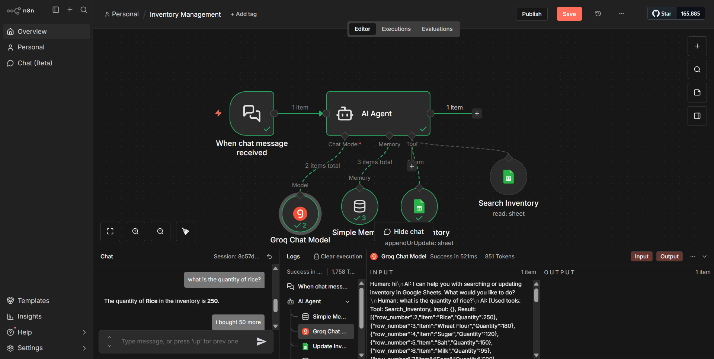
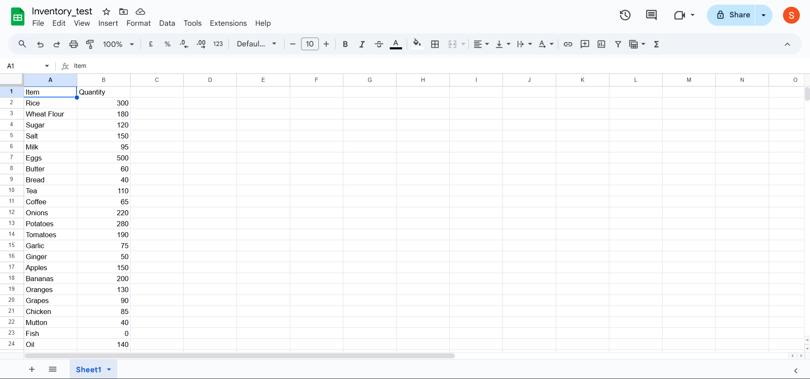

## Demo

A full walkthrough of the workflow and chat interaction is available here:  
👉 https://www.loom.com/share/f3bc189e7d5c45048b3e5c1cf17b2ddc

# AI-Powered Inventory Management Agent (n8n)

An AI-driven inventory management system built using **n8n** that allows users to query, update, add, or reduce inventory quantities using natural language chat. The system uses an LLM-based AI Agent connected to Google Sheets as a live inventory database.

---

## Problem

Managing inventory using spreadsheets is time-consuming and error-prone.  
Users often need to:
- Check stock levels quickly
- Update quantities after purchases or sales
- Avoid manual edits in Google Sheets
- Handle inventory queries without technical knowledge

Traditional systems lack a conversational and intelligent interface for real-time inventory management.

---

## Solution

This project solves the problem by introducing a **chat-based AI Inventory Assistant** that:
- Understands natural language queries
- Reads inventory data from Google Sheets
- Updates stock quantities automatically
- Maintains conversational context using memory
- Prevents incorrect updates using tool-based constraints

All actions are performed through a simple chat interface.

---

## Workflow Overview

**Flow:**
1. Chat message is received
2. AI Agent interprets user intent
3. Inventory data is fetched from Google Sheets
4. AI decides whether to read or update inventory
5. Google Sheets is updated (if required)
6. User receives a clear response

---

## Key Features

- Natural language inventory queries  
- Add or subtract item quantities via chat  
- Live Google Sheets integration  
- Memory-enabled AI conversations  
- Tool-restricted AI actions for safety  
- Real-time feedback to the user  

---

## Tech Stack

- **n8n** – Workflow automation  
- **Groq LLM** – AI reasoning & language understanding  
- **Google Sheets API** – Inventory database  
- **AI Agent (n8n)** – Tool-based decision making  
- **Simple Memory** – Conversation context handling  

---

## Inventory Data Structure

Google Sheet columns:
- `Item`
- `Quantity`

Each row represents a live inventory item.

---

## Example Queries

- *“What is the quantity of rice?”*  
- *“I bought 50 more eggs”*  
- *“Reduce sugar by 10 units”*  
- *“Show inventory for milk”*

---

## Workflow Overview

---

## Google Sheets Input / Output

---

## Use Cases

- Small businesses
- Grocery stores
- Warehouse tracking
- Internal inventory assistants
- Automation demos using n8n + AI
